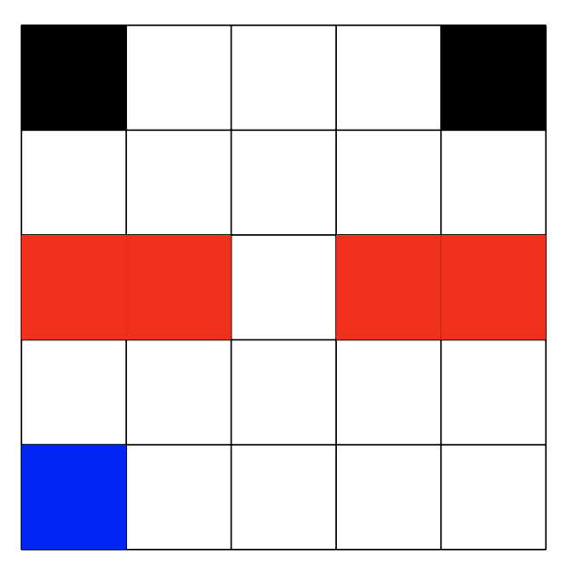
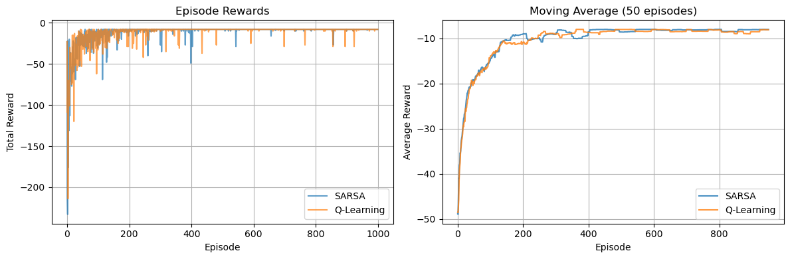
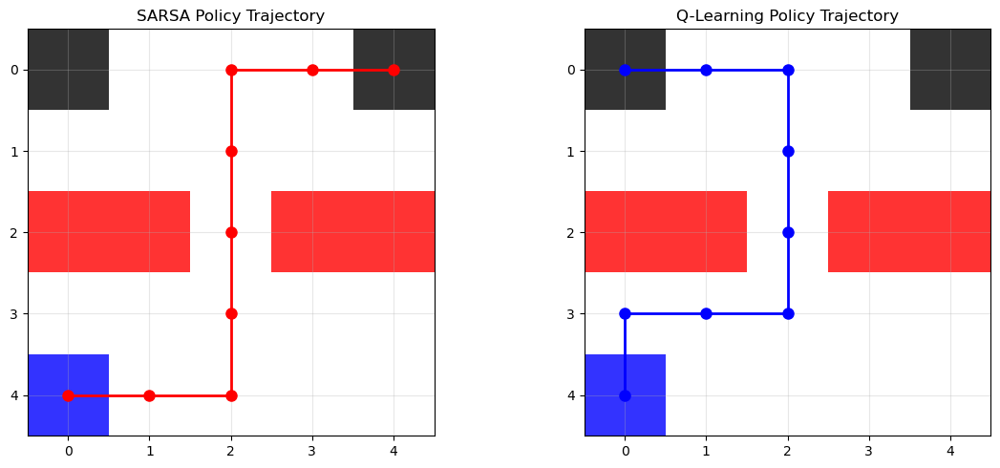

```{r setup, include=FALSE}
knitr::opts_chunk$set(echo = FALSE, warning = FALSE, message = FALSE, 
                      fig.pos = "H", fig.align = "center")
```

# Introduction

This report presents a comparative analysis of two fundamental temporal difference learning algorithms: **SARSA** (State-Action-Reward-State-Action) and **Q-Learning**, implemented on a 5×5 grid world environment. These algorithms represent the key paradigms in reinforcement learning: on-policy learning (SARSA) versus off-policy learning (Q-Learning).

The experimental environment consists of a grid world with distinct state types: a start state (blue), terminal states (black), penalty states (red) that impose -20 reward and reset the agent, and regular states (white) with -1 step cost. The agent's objective is to navigate from the start position (4,0) to any terminal state while minimizing cumulative negative rewards.

```{r grid-setup, fig.cap="Setup for Grid World", out.width="150px"}

```
## Algorithmic Differences

**SARSA** follows an on-policy approach, updating Q-values based on the action actually taken by the current policy:
$$Q(s,a) \leftarrow Q(s,a) + \alpha[r + \gamma Q(s',a') - Q(s,a)]$$

**Q-Learning** implements off-policy learning, updating Q-values using the maximum Q-value for the next state regardless of the action taken:
$$Q(s,a) \leftarrow Q(s,a) + \alpha[r + \gamma \max_{a'} Q(s',a') - Q(s,a)]$$

where $\alpha=0.1$ (learning rate), $\gamma=0.95$ (discount factor), and $\epsilon=0.1$ (exploration rate with decay).

# Methodology

Both algorithms were trained for 1,000 episodes using identical hyperparameters and random seeds to ensure fair comparison. The implementation utilized JAX for efficient computation with JIT compilation. An $\epsilon$-greedy exploration strategy was employed with exponential decay ($\epsilon_{new} = \max(0.01, \epsilon_{old} \times 0.995)$) to balance exploration and exploitation over time.

Performance metrics included episode rewards, convergence behavior, and final policy trajectories. The training process monitored cumulative rewards per episode and computed moving averages to assess learning stability and convergence rates.

# Results and Analysis

## Learning Performance

```{r learning-curves, fig.cap="Learning curves showing episode rewards (left) and 50-episode moving average (right) for SARSA and Q-Learning algorithms", out.width="100%"}

```

Figure 2 demonstrates the learning progression of both algorithms over 1,000 episodes. The raw episode rewards (left panel) show high initial variability as both algorithms explore the environment. The moving average (right panel) reveals convergence patterns: both algorithms achieve similar final performance around -8 to -10 average reward, indicating successful learning of near-optimal policies.

Both algorithms exhibited rapid improvement in the first 200 episodes. SARSA converges to approximately -8.02 average reward, while Q-Learning achieves -8.08. Q-Learning shows slightly more stable convergence in later episodes. Final performance differs by less than 1%, suggesting both algorithms found effective solutions  

## Policy Trajectories

```{r trajectories, fig.cap="Learned policy trajectories showing SARSA (left, red path) and Q-Learning (right, blue path) navigation strategies in the grid world environment", out.width="90%"}

```

Figure 3 illustrates the distinct navigation strategies learned by each algorithm.

**SARSA Trajectory**:  

- Takes a more conservative path, moving horizontally first then vertically
- Avoids direct proximity to penalty states in early moves
- Reaches the top-right terminal state (0,4).

**Q-Learning Trajectory**:

- Adopts a more direct vertical-first approach
- Moves closer to penalty states earlier in the path
- Reaches the top-left terminal state (0,0)

## Behavioral Analysis

1. **Risk Tolerance**: Q-Learning's off-policy nature enables learning about optimal actions independent of exploration, resulting in more aggressive paths near penalty states.

2. **Policy Conservatism**: SARSA's on-policy learning incorporates exploration risks into value estimates, producing more conservative trajectories that maintain safety margins from penalty states.

3. **Path Efficiency**: Both paths require 8 steps, but Q-Learning's route demonstrates slightly more direct navigation, consistent with its optimistic value updates.

# Conclusion

This comparative study reveals that both SARSA and Q-Learning successfully solve the grid world navigation problem with comparable final performance. However, their distinct learning paradigms manifest in different behavioral strategies:

- **Performance**: Both algorithms converge to similar reward levels (~-8), validating their effectiveness for this task
- **Strategy**: Q-Learning learns more aggressive policies due to its off-policy nature, while SARSA exhibits conservative behavior reflecting on-policy learning
- **Robustness**: SARSA's cautious approach may be preferable in safety-critical applications, while Q-Learning's optimistic updates suit environments where exploration risks are acceptable

The results confirm theoretical expectations about on-policy versus off-policy learning, demonstrating how algorithmic choices impact not just performance but also the nature of learned behaviors. This analysis provides valuable insights for algorithm selection in reinforcement learning applications where safety, efficiency, and risk tolerance are key considerations.

Future work could explore these algorithms' performance under different environmental configurations, alternative exploration strategies, and varying penalty structures to further characterize their behavioral differences and optimal application domains.
